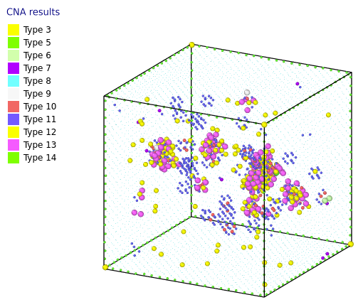

CNA analysis:

example usage:

fcc atoms detection:  cna -i atomsNi025.xyz -d 2.5 -tol 0.5 -aafcc -tolA 0.2 -th 8 -nb 12 -v -ofcc   Ni025fcc.xyz -onfcct Ni025nofcc.xyz -ps
zbb atoms detection:  cna -i sphZb.xyz -d 1.53 -tol 0.25 -nb 4 -v  -aazb -tolA 0.25 -ozbt  osphZb.xyz -onzbt osphNZb.xyz -ps

#------------------------------------------------------------------------------

(visualization by Ovito https://www.ovito.org/)

#------------------------------------------------------------------------------
